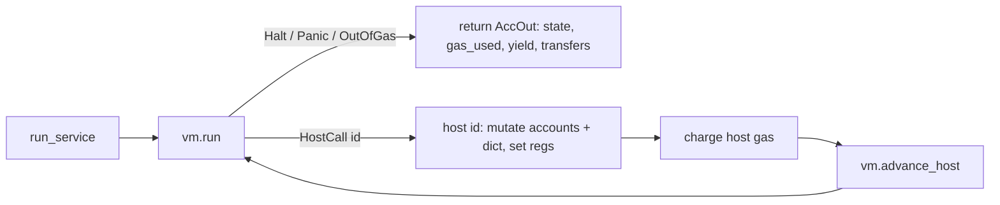

# The PVM: how the JAM Polkadot Virtual Machine works

How this codebase implements the JAM **PVM** (Gray Paper Appendix A) — the
byte-code interpreter that runs service logic — covering the data model, the
decode→execute→halt flow, gas, memory, host calls, and the exact source layout.
It also answers: *do I need compiler and operating-system background to
understand it?* (Short answer: a little of each helps a lot, and this document
teaches the pieces you need.)

> 中文版本：[`pvm.zh.md`](./pvm.zh.md)

Source: [`src/pvm.rs`](../src/pvm.rs) (machine + decoder), included file
[`src/pvm_exec.rs`](../src/pvm_exec.rs) (instruction execution), and
[`src/accumulate_exec.rs`](../src/accumulate_exec.rs) (`spi` program
initialization + `run_service` host-call loop).

## 1. What the PVM is

The PVM is a small, **deterministic register machine**. JAM services are
compiled to PVM byte-code; the chain runs that byte-code to *refine* work
in-core and to *accumulate* results on-chain. "Deterministic" is the whole
point: every validator must execute the same program on the same input and get
**bit-identical** results and **identical gas**, or consensus breaks.

Concretely (`src/pvm.rs`):

- **13 registers** (`REG_COUNT = 13`), each a 64-bit word (`[u64; 13]`).
- **A 2³²-byte byte-addressed memory** (`Memory`), organized in **4096-byte
  pages** (`PAGE_SIZE`), each page independently readable/writable.
- **A gas counter** (`i64`) decremented as instructions run; hitting zero halts
  the machine (`OutOfGas`).
- **A program counter** `pc` into the code.

It is a **RISC-style** instruction set derived from RISC-V / PolkaVM: fixed set
of opcodes, load/store to memory, arithmetic on registers, branches and jumps.
There is no real hardware, no real OS — it is a pure software interpreter, so
its behaviour is fully defined by the Gray Paper and reproducible everywhere.

## 2. The program blob and how it is decoded (`deblob`)

A service ships as a **program blob**. `deblob` (`src/pvm.rs`) parses it into a
`Program { code, bitmask, jump_table, blocks }`:

```
blob = ┌───────────────┬───┬────────────┬──────────────┬─────────┬──────────┐
       │ n_jump (cmpct)│ z │ n_code(cmpt│ jump_table   │ code    │ bitmask  │
       │  # jump ents  │wid│  code len  │ n_jump × z B │ n_code B │⌈n_code/8⌉│
       └───────────────┴───┴────────────┴──────────────┴─────────┴──────────┘
```

- **Compact integers** (`read_compact`, Gray Paper Appendix C): a variable-width
  integer encoding. The first byte's leading one-bits say how many extra bytes
  follow; small values are a single byte. Used for lengths.
- **`jump_table`**: `n_jump` entries, each `z` bytes wide (little-endian). It is
  the set of *legal dynamic-jump targets* (see §6).
- **`code`**: the raw instruction bytes.
- **`bitmask`**: one bit per code byte. A set bit marks the **start of an
  instruction** (an opcode); clear bits are that instruction's operand bytes.
  This is how the decoder finds instruction boundaries in a **variable-length**
  encoding.

### Finding one instruction

Instructions vary in length. Given the opcode at index `i`, `skip(bitmask, i)`
counts the clear bits after `i` (capped at 24) to find where the **next**
opcode starts; that count is also the operand byte-length `ℓ`. So the decoder
never needs a length field — the bitmask is the length table. Operand immediates
are read little-endian (`decode`) and sign-extended when needed (`sext`).

## 3. Basic blocks and gas

This is the one place where **compiler theory** shows up directly.

A **basic block** is a maximal straight-line run of instructions with a single
entry and a single exit: control only enters at the top and only leaves at the
bottom (via a *terminator* — a jump, branch, trap, or halt). `is_terminator`
lists the terminator opcodes; `basic_blocks` scans the code and records every
block-start index (block 0, and the instruction after every terminator).

Gas is charged **per basic block, on entry** (`Vm::run`):

```
block_gas_cost(block) = number of instructions in the block
```

Because a block is straight-line, its instruction count is known statically, so
the machine can check "do I have enough gas for this whole block?" once, on
entry, instead of per instruction. If not, it stops with `OutOfGas` **before**
executing the block. This matches the Gray Paper's per-instruction model for
any block that runs to completion (entering the block ⇒ every instruction in it
runs), while being cheaper to evaluate.

> Subtlety learned from conformance: when a run is cut short *inside* a block —
> **out of gas** — the Gray Paper charges instruction-by-instruction until the
> budget is exhausted, i.e. the whole remaining budget is consumed. See
> `run_service` in `src/accumulate_exec.rs`, which reports full-budget
> consumption on `OutOfGas` (and partial gas on a mid-block panic/fault).

## 4. Memory: pages, guards, faults, and the heap

`Memory` (`src/pvm.rs`) is where **operating-system** concepts appear, as
software analogues:

- **Paging.** Memory is a `BTreeMap<page_index, Page>`; only touched pages
  exist (sparse). `map(addr, len, writable)` allocates whole pages for a region
  — this is the software equivalent of an MMU page table.
- **Protection.** Each `Page` has a `writable` flag. Reads need a readable page;
  writes need a writable one (`readable` / `writable` / `range_ok`).
- **Guard region.** Any address below `2¹⁶` is never accessible — a **null/guard
  zone** that turns stray low-address accesses into a hard **panic** (`check`).
- **Page fault vs panic.** `check` distinguishes failure modes by cause: an
  access below `2¹⁶` is a `Panic`, and a **write** to a mapped but read-only
  page is also a `Panic` (a hard protection violation); only an access to a
  genuinely **unmapped** page ≥ `2¹⁶` is a `PageFault(addr)` (recoverable in
  principle). This mirrors a real CPU's trap-vs-fault distinction.
- **The heap and `sbrk`.** `heap_top` is the current **program break** and
  `heap_max` the reserved ceiling. `sbrk(size)` grows the heap (mapping new
  pages) and returns the old break, or the current break when `size == 0`
  (a query), or `0` if it would exceed `heap_max`. This is exactly Unix
  `sbrk(2)`/`brk` for a growable heap.

If you have seen virtual memory, page tables, `mmap`, guard pages, and `brk`,
this is those ideas in miniature. If you have not: a "page" is a fixed 4 KiB
chunk; "mapped" means it exists and may be read; "writable" means it may also be
written; touching anything else stops the machine.

## 5. The execution loop

There are two entry points:

- **One-shot** `run(program, pc, gas, regs, page_map, memory_init) -> Outcome`:
  decode, lay out initial memory, execute until a halting condition, return the
  final state. Used where there are no host calls.
- **Resumable** `Vm` (`struct Vm`): the same machine, but pausable. Accumulate
  needs this because service code makes **host calls** back into the chain
  (§7), which must be handled outside the VM and then resumed.

`Vm::run` is the core loop (simplified):

```
loop {
    if !gas_charged {                       // entering a new basic block
        cost = block_gas_cost(block_start_of(pc))
        if gas < cost { return OutOfGas }
        gas -= cost; gas_charged = true
    }
    op   = code[pc]                          // decode
    ℓ    = skip(bitmask, pc)                 // operand length
    next = pc + 1 + ℓ
    match execute(op, pc, ℓ, regs, memory) { // run one instruction
        Next          => { pc = next; if is_terminator(op) { gas_charged = false } }
        Jump(target)  => { pc = target;   gas_charged = false }   // new block
        Halt          => return Halt
        Panic         => return Panic
        PageFault(a)  => return PageFault(a)
        HostCall(id)  => return HostCall(id) // pause; caller handles it
    }
}
```

`execute` (`src/pvm_exec.rs`) is a big `match` on the opcode. Opcodes are grouped
by **operand shape**, not by meaning — e.g. "no arguments", "one immediate",
"one register + immediate", "two registers", "load", "store", "branch". Each arm
decodes its operands (`ra`, `rb`, `rd`, immediates) and returns an `Action`:

| `Action`      | meaning                                             |
|---------------|-----------------------------------------------------|
| `Next`        | advance to the next instruction                     |
| `Jump(t)`     | static jump to a block start                        |
| `Halt`        | normal completion (jump to `HALT_ADDR`)             |
| `Panic`       | trap (opcode 0, bad access, invalid dynamic jump)   |
| `PageFault(a)`| access to an unmapped/protected page                |
| `HostCall(id)`| the `ecalli` instruction (opcode 10)                |

**`Action` is only the *control-flow* verdict, not the work an instruction does.**
Arithmetic, logic, shifts, comparisons, register moves, and load/store all do
their real work by **mutating registers or memory**, then fall through with
`Action::Next`. That is why add/subtract/multiply/divide are not in the table
above — they are `Next` instructions. Only the six outcomes that change *where
execution goes* get their own variant.

The arithmetic lives inside `execute`, grouped by operand shape. For example the
**three-register** arm (`op = regs[ra] ⊕ regs[rb] → regs[rd]`):

| opcode      | operation                        |
|-------------|----------------------------------|
| `190 / 200` | add (32-bit / 64-bit)            |
| `191 / 201` | subtract                         |
| `192 / 202` | multiply                         |
| `193 / 194` | divide (unsigned / signed)       |
| `195 / 196` | remainder (unsigned / signed)    |
| others      | and / or / xor, shifts, set-if-less-than, min/max … |

and the **register + immediate** arm (`120..=161`) does the same against an
immediate (`149` add-imm, `150` mul-imm, …). Each computes `regs[rd] = …` and
returns `Action::Next`; division guards `b == 0` (returns all-ones / the
dividend, per the Gray Paper) rather than trapping.

## 6. Control flow: static jumps, branches, dynamic jumps

- **Static jump / branch** (`jump`, `branch`): the target is an offset in the
  code. It is only legal if it lands on a **basic-block start** (`is_block_start`);
  otherwise the machine panics. This prevents jumping into the middle of an
  instruction.
- **Dynamic jump** (`djump`): the target comes from a **register** (computed at
  run time). It is validated against the **`jump_table`** with an alignment rule
  (`DYN_ALIGN`): the register value must be a valid, aligned table index, and the
  table entry must be a block start. A special value routes to `HALT_ADDR`
  (normal return). Anything else panics. This is how the PVM safely supports
  function pointers / returns / switch tables without allowing arbitrary jumps.

## 7. Host calls: leaving and re-entering the VM

Service code cannot touch chain state directly. Instead it executes the
**`ecalli`** instruction (opcode `10`), whose immediate is a **host-call
number**. `execute` returns `Action::HostCall(id)`, and `Vm::run` returns
`ExitStatus::HostCall(id)` — the VM **pauses** with the `pc` still sitting on the
`ecalli`.

The caller (`run_service` in `src/accumulate_exec.rs`) then:

1. runs the host function for `id` (`host(...)`): read/write service storage,
   look up preimages, transfer balance, solicit/forget preimages, `yield` an
   output, etc. — mutating the *accumulation context*, and setting result
   registers;
2. charges the host-call gas (a flat 10, plus a reserved-gas surcharge for
   `transfer`);
3. calls `vm.advance_host()` to step the `pc` past the `ecalli` (same basic
   block, gas already charged);
4. resumes `vm.run()`.



The register-level contract is the **host ABI**: which registers carry which
argument, and which return code comes back. Return codes are Gray Paper
constants (`NONE = 2⁶⁴−1`, `WHO = 2⁶⁴−4`, `HUH = 2⁶⁴−9`, `CASH = 2⁶⁴−7`, …); a
service branches on them, so they must match the spec exactly.

## 8. Standard-program initialization (`spi`, the `Y` function)

Before a service's `accumulate` runs, its code blob and inputs must be laid into
a fresh machine. `spi` (`src/accumulate_exec.rs`) implements the Gray Paper
standard-program initialization `Y`:

- locate the standard-program blob inside the jam-pvm container;
- carve the address space into read-only data, read-write data, a **stack**, and
  a reserved **heap zone** (setting `heap_top`/`heap_max` for `sbrk`);
- copy the argument bytes (the encoded `(slot, service, operand-count)`) into a
  known input region;
- set the initial registers (stack pointer, argument pointer/length, return
  address = `HALT_ADDR`).

The result is a `(code, regs, memory, …)` tuple handed to `Vm::new`.

## 9. End-to-end data flow

```
service code blob
   │  deblob (§2)
   ▼
Program { code, bitmask, jump_table, blocks }
   │  spi / Y (§8):  + args, + initial memory (ro/rw/stack/heap), + regs
   ▼
Vm { pc, gas, regs:[u64;13], memory }
   │  run loop (§5):  decode → execute → Action
   ├── Next / Jump / branch / djump ...............→ keep looping
   ├── HostCall(id) → host() mutates chain context → advance_host → loop  (§7)
   └── Halt / Panic / OutOfGas / PageFault ........→ stop
   ▼
Outcome / AccOut { final regs+memory, gas_used, yielded output, transfers }
```

Determinism holds because every step is a pure function of the current state:
the same blob + args + gas always yields the same `pc`/register/memory trace and
the same gas. That is what lets an independent implementation's **golden
execution trace** (per-instruction `opcode`/`pc`/`gas`/registers) be diffed
against this one to pin down any divergence.

## 10. Do I need compiler / OS background?

You do **not** need to have built a compiler or an OS, but a few concepts from
each make the code obvious rather than mysterious:

**From compilers / computer architecture (most useful):**

- *Instruction encoding & decoding* — variable-length instructions, the opcode
  bitmask as a boundary table, little-endian immediates, sign extension.
- *Basic blocks & control-flow graphs* — the unit of gas charging and the only
  legal jump targets (§3, §6).
- *Jump tables* — how dynamic jumps (function pointers, switch) are made safe.
- *Register machines & calling conventions* — registers, stack pointer, return
  address, the host-call ABI (§7–8).

**From operating systems (helpful for the memory model, §4):**

- *Paged virtual memory & protection* — pages, read/write bits, mapping.
- *Page faults vs traps* — the `PageFault` vs `Panic` distinction.
- *Guard pages / null-page protection* — the sub-`2¹⁶` guard region.
- *The program break (`brk`/`sbrk`)* — heap growth.

**You do NOT need:** real hardware/MMU knowledge, kernel internals, threading,
or scheduling. The PVM is single-threaded, synchronous, and fully specified;
there is no concurrency and no real I/O. If a term above is unfamiliar, §2–§4
define the miniature version you actually need here.

## 11. Where to read the code

| Concern                         | Location                                             |
|---------------------------------|------------------------------------------------------|
| Machine state, memory, gas, run | `src/pvm.rs` (`Vm`, `Memory`, `run`, `block_gas_cost`)|
| Blob decode                     | `src/pvm.rs` (`deblob`, `read_compact`, `basic_blocks`)|
| Instruction semantics           | `src/pvm_exec.rs` (`execute`, `is_valid_opcode`)     |
| Program init + host-call loop   | `src/accumulate_exec.rs` (`spi`, `run_service`, `host`)|
| Conformance                     | 311/311 PVM test vectors; validated against jam-duna golden traces |

## 12. Instruction set reference

The complete set implemented in `execute` (`src/pvm_exec.rs`), grouped by
operand shape as in the Gray Paper / PolkaVM. Every instruction is **integer**;
the six control-flow outcomes are `Action`s (§5), everything else writes a
register or memory and continues.

**No operands**

| op | meaning |
|----|---------|
| 0  | `trap` (panic) |
| 1  | `fallthrough` (ends a block, lands on the next block) |
| 2  | hint (no-op) |

**Immediates / load-immediate**

| op | meaning |
|----|---------|
| 10 | `ecalli` host call |
| 20 | load 64-bit immediate |
| 51 | load immediate |
| 80 | load immediate + static jump |

**Memory load**

| op | meaning |
|----|---------|
| 52–58 | absolute-address load u8/i8/u16/i16/u32/i32/u64 |
| 124–130 | indexed `[rb+imm]` load u8/i8/u16/i16/u32/i32/u64 |

**Memory store**

| op | meaning |
|----|---------|
| 30–33 | store immediate to absolute address u8/u16/u32/u64 |
| 59–62 | store register to absolute address u8/u16/u32/u64 |
| 70–73 | store immediate to `[ra+imm]` u8/u16/u32/u64 |
| 120–123 | store register to `[rb+imm]` u8/u16/u32/u64 |

**Jumps / branches (control flow, block terminators)**

| op | meaning |
|----|---------|
| 40 | static jump |
| 50 | indirect jump `djump(ra+imm)` |
| 180 | set register + indirect jump |
| 81–90 | branch on compare-with-immediate: `== != <u ≤u ≥u >u <s ≤s ≥s >s` |
| 170–175 | branch on two-register compare: `== != <u <s ≥u ≥s` |

**Bit counting / extend / byte order (two registers)**

| op | meaning |
|----|---------|
| 100 | move register |
| 101 | `sbrk` (grow heap) |
| 102/103 | popcount 64/32 |
| 104/105 | leading-zero count 64/32 |
| 106/107 | trailing-zero count 64/32 |
| 108/109 | sign-extend 8/16 |
| 110 | zero-extend 16 |
| 111 | byte-reverse |

**Arithmetic / logic / shift (three registers 190–230; immediate forms 131–161)**

| op | meaning |
|----|---------|
| 190/200 | add 32/64 |
| 191/201 | subtract 32/64 |
| 192/202 | multiply 32/64 |
| 193/203 | divide unsigned 32/64 |
| 194/204 | divide signed 32/64 |
| 195/205 | remainder unsigned 32/64 |
| 196/206 | remainder signed 32/64 |
| 213/214/215 | multiply-high 64 bits (ss / uu / su) |
| 197–199 / 207–209 | shift left / logical right / arithmetic right (32 / 64) |
| 210/211/212 | and / xor / or |
| 224/225/226 | `a&!b` / `a\|!b` / xnor |
| 216/217 | set-if-less-than (unsigned / signed) |
| 218/219 | conditional move (if `b==0` / `b≠0`) |
| 220–223 | rotate left / right (64 / 32) |
| 227–230 | max_s / max_u / min_s / min_u |
| 131–161 | register-plus-immediate forms of the above |

Any undefined opcode returns `Action::Panic`.

## 13. What it is: a curated ISA, not an operating system

The PVM is **PolkaVM** — a virtual instruction set designed by Parity, derived
from **RISC-V** (an RV64 integer base plus bit-manipulation-style ops). It is a
Turing-complete general-purpose *integer compute engine*, not a kernel: there
are no processes, scheduling, or interrupts. The OS-looking parts are a
**sandbox + ABI**, not an OS — paged memory with guard pages is memory
isolation, `sbrk` is a per-program heap primitive, and `ecalli` is the single
outward channel (like a syscall, but into the *chain host* rather than a
kernel).

**Spec ownership.** The *machine specification* — opcode numbers, the
variable-length encoding + bitmask, the jump table, the 13 registers, basic
blocks and gas, the memory/guard/`sbrk` model, and the `ecalli` host ABI — is
defined by the **Gray Paper Appendix A (the PolkaVM spec)**, *not* by the
general RISC-V standard. Only the *per-operation semantics* borrow from RISC-V's
`I`/`M`/`Zbb` subset (plus a few PVM-only instructions). Consequently the PVM
**cannot** run native RISC-V binaries — the opcodes, register count, and
encoding all differ.

Deliberate trade-offs for the blockchain setting (every node must compute a
**bit-identical** result):

| trade-off | why |
|-----------|-----|
| integer only, **no floating point** | float results differ across platforms and would break consensus determinism |
| **defined** divide-by-zero / overflow (÷0 → all-ones, rem → dividend, wrapping arithmetic, `MIN/-1` special-cased) | removes undefined behaviour → every node agrees bit-for-bit |
| **no privileged / system instructions** (no CSR, interrupts, atomics, fences, supervisor mode) | there is no real OS to talk to; the only side-effect exit is `ecalli` |
| **gas metering** (per basic block, on entry) | guarantees halting / prevents DoS and gives predictable pricing |
| **structured control flow** (jumps land only on block starts; dynamic jumps must hit the jump table) | statically analysable, meterable, safely JIT-able; no jumping into mid-instruction |
| **memory sandbox** (4 KiB pages, R/W bits, `2¹⁶` guard, page-fault vs panic) | isolates untrusted service code |
| **built-in bit ops** (popcount / clz / ctz / byte-reverse / rotate / mul-high) | make hashing, cryptography and serialization in services efficient |
| **no SIMD / vectors / atomics / threads** | single-threaded synchronous execution keeps determinism and metering simple |

In one line: a carefully trimmed, **deterministic, sandboxed, gas-metered
RISC-V-style integer ISA**, purpose-built so that many nodes running the same
program on the same input reach exactly the same state — not an operating system.
