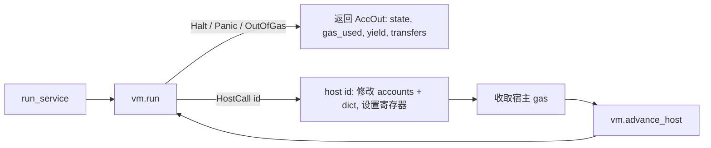

# PVM：JAM 的 Polkadot 虚拟机工作原理

本文说明本仓库如何实现 JAM 的 **PVM**（灰皮书附录 A）——运行服务逻辑的字节码
解释器，涵盖数据模型、解码→执行→停机的流程、燃料（gas）、内存、宿主调用，以及
对应的源码位置。并回答一个常见问题：*理解它是否需要编译原理和操作系统背景？*
（简短回答：两者各懂一点会很有帮助；本文也会把你需要的关键概念讲清楚。）

> English version: [`pvm.md`](./pvm.md)

源码：[`src/pvm.rs`](../src/pvm.rs)（机器 + 解码器）、被包含的
[`src/pvm_exec.rs`](../src/pvm_exec.rs)（指令执行）、以及
[`src/accumulate_exec.rs`](../src/accumulate_exec.rs)（`spi` 程序初始化 +
`run_service` 宿主调用循环）。

## 1. PVM 是什么

PVM 是一台小巧的**确定性寄存器机**。JAM 服务被编译成 PVM 字节码；链上运行这些字节
码，用于在核内 *refine*（精炼）工作、在链上 *accumulate*（累加）结果。“确定性”是
根本要求：每个验证者对同一程序、同一输入执行后，必须得到**逐位相同**的结果和
**完全相同的 gas**，否则共识会分裂。

具体而言（`src/pvm.rs`）：

- **13 个寄存器**（`REG_COUNT = 13`），每个为 64 位字（`[u64; 13]`）。
- **一块 2³² 字节、按字节寻址的内存**（`Memory`），以 **4096 字节的页**
  （`PAGE_SIZE`）组织，每页可独立读/写。
- **一个 gas 计数器**（`i64`），随指令执行递减；减到零则停机（`OutOfGas`）。
- **一个程序计数器** `pc`，指向代码。

它是一套源自 RISC-V / PolkaVM 的 **RISC 风格**指令集：固定的操作码集合、对内存的
load/store、对寄存器的算术运算、分支与跳转。这里没有真实硬件、没有真实操作系统——
它是纯软件解释器，因此行为完全由灰皮书定义，可在任何地方复现。

## 2. 程序 blob 及其解码（`deblob`）

服务以**程序 blob** 形式发布。`deblob`（`src/pvm.rs`）把它解析为
`Program { code, bitmask, jump_table, blocks }`：

```
blob = ┌───────────────┬───┬────────────┬──────────────┬─────────┬──────────┐
       │ n_jump (紧凑) │ z │ n_code(紧凑│ jump_table   │ code    │ bitmask  │
       │  跳转表条目数 │宽 │  代码长度  │ n_jump × z B │ n_code B │⌈n_code/8⌉│
       └───────────────┴───┴────────────┴──────────────┴─────────┴──────────┘
```

- **紧凑整数**（`read_compact`，灰皮书附录 C）：变长整数编码。首字节的前导 1 比特
  数量表示后面还有几个字节；小值只占一个字节。用于各类长度。
- **`jump_table`**：`n_jump` 个条目，每个 `z` 字节宽（小端）。它是*合法动态跳转目标*
  的集合（见 §6）。
- **`code`**：原始指令字节。
- **`bitmask`**：每个代码字节对应一比特。置位比特标记**一条指令的起始**（操作码）；
  清零比特是该指令的操作数字节。这是解码器在**变长**编码中定位指令边界的方式。

### 定位一条指令

指令长度可变。给定索引 `i` 处的操作码，`skip(bitmask, i)` 统计 `i` 之后的清零比特
数（上限 24），据此找到**下一条**操作码的起点；这个计数同时就是操作数字节长度
`ℓ`。因此解码器无需长度字段——bitmask 就是长度表。操作数立即数按小端读取
（`decode`），必要时做符号扩展（`sext`）。

## 3. 基本块与 gas

这是**编译原理**唯一直接体现的地方。

**基本块（basic block）**是一段极大化的顺序指令序列，只有单一入口和单一出口：控制
流只从顶部进入、只从底部离开（经由*终结指令*——跳转、分支、陷入或停机）。
`is_terminator` 列出终结操作码；`basic_blocks` 扫描代码，记录每个块起始索引（块 0，
以及每个终结指令之后的那条指令）。

gas 按**基本块、在进入时**收取（`Vm::run`）：

```
block_gas_cost(块) = 该块中的指令数量
```

因为块是顺序执行的，其指令数量在静态即可确定，所以机器只需在进入时检查一次
“我是否有足够 gas 跑完整个块？”，而不必逐条检查。若不够，则在执行该块**之前**以
`OutOfGas` 停机。对于能跑完的块，这与灰皮书“逐指令计费”的模型一致（进入块 ⇒ 块内
每条指令都会执行），但求值更廉价。

> 一致性测试得到的细节：当一次运行在块*内部*被中断——即**gas 耗尽**——灰皮书按
> 逐指令计费直到预算用尽，即把剩余预算全部消耗。参见 `src/accumulate_exec.rs` 的
> `run_service`：在 `OutOfGas` 时按“整份预算耗尽”上报（块内 panic/fault 则按已执行
> 部分计费）。

## 4. 内存：页、护栏、缺页、堆

`Memory`（`src/pvm.rs`）是**操作系统**概念出现的地方，均为软件对应物：

- **分页。** 内存是 `BTreeMap<页号, Page>`；只有被触及的页才存在（稀疏）。
  `map(addr, len, writable)` 为一个区域按整页分配——相当于软件版的 MMU 页表。
- **保护。** 每个 `Page` 有 `writable` 标志。读需要可读页，写需要可写页
  （`readable` / `writable` / `range_ok`）。
- **护栏区。** 任何低于 `2¹⁶` 的地址永不可访问——这是**空/护栏区**，将越界的低地址
  访问变成硬性 **panic**（`check`）。
- **缺页 vs panic。** `check` 按成因区分失败：低于 `2¹⁶` 的访问是 `Panic`；对一个已
  映射但只读的页进行**写**也是 `Panic`（硬性保护违规）；只有对 ≥ `2¹⁶` 的**真正未
  映射**页的访问才是 `PageFault(addr)`（原则上可恢复）。这对应真实 CPU 的 trap 与
  fault 之分。
- **堆与 `sbrk`。** `heap_top` 是当前**程序断点（program break）**，`heap_max` 是保留
  上限。`sbrk(size)` 增长堆（映射新页）并返回旧断点；`size == 0` 时返回当前断点
  （查询）；若会超过 `heap_max` 则返回 `0`。这正是 Unix 的 `sbrk(2)`/`brk`。

如果你了解虚拟内存、页表、`mmap`、护栏页、`brk`，这些就是它们的微缩版。如果没接触
过：一“页”就是固定的 4 KiB 块；“已映射”表示它存在且可读；“可写”表示还可写；碰其他
任何地址都会让机器停机。

## 5. 执行循环

有两个入口：

- **一次性** `run(program, pc, gas, regs, page_map, memory_init) -> Outcome`：
  解码、铺设初始内存、执行到停机条件、返回最终状态。用于没有宿主调用的场景。
- **可恢复** `Vm`（`struct Vm`）：同一台机器，但可暂停。累加需要它，因为服务代码会
  发起**宿主调用**回到链上（§7），这些调用必须在 VM 外处理后再恢复。

`Vm::run` 是核心循环（简化）：

```
loop {
    if !gas_charged {                       // 进入一个新基本块
        cost = block_gas_cost(block_start_of(pc))
        if gas < cost { return OutOfGas }
        gas -= cost; gas_charged = true
    }
    op   = code[pc]                          // 解码
    ℓ    = skip(bitmask, pc)                 // 操作数长度
    next = pc + 1 + ℓ
    match execute(op, pc, ℓ, regs, memory) { // 执行一条指令
        Next          => { pc = next; if is_terminator(op) { gas_charged = false } }
        Jump(target)  => { pc = target;   gas_charged = false }   // 新块
        Halt          => return Halt
        Panic         => return Panic
        PageFault(a)  => return PageFault(a)
        HostCall(id)  => return HostCall(id) // 暂停；由调用方处理
    }
}
```

`execute`（`src/pvm_exec.rs`）是对操作码的一个大 `match`。操作码按**操作数形态**分组
（而非按语义），例如“无参数”“一个立即数”“一个寄存器 + 立即数”“两个寄存器”“load”
“store”“分支”。每个分支解码自己的操作数（`ra`、`rb`、`rd`、立即数）并返回一个
`Action`：

| `Action`      | 含义                                             |
|---------------|--------------------------------------------------|
| `Next`        | 前进到下一条指令                                 |
| `Jump(t)`     | 静态跳转到某个块起始                             |
| `Halt`        | 正常结束（跳到 `HALT_ADDR`）                     |
| `Panic`       | 陷入（操作码 0、非法访问、非法动态跳转）         |
| `PageFault(a)`| 访问未映射/受保护的页                           |
| `HostCall(id)`| `ecalli` 指令（操作码 10）                       |

**`Action` 只表示*控制流*结果，不表示指令“做了什么运算”。** 算术、逻辑、移位、比较、
寄存器搬移、load/store 都是通过**改写寄存器或内存**完成真正的工作，然后以
`Action::Next` 顺序前进。这就是为什么加减乘除不在上表里——它们都属于 `Next` 指令。
只有那六种“改变执行去向”的结局才有各自的变体。

算术运算就在 `execute` 里，按操作数形态分组。例如**三寄存器**分支
（`op = regs[ra] ⊕ regs[rb] → regs[rd]`）：

| 操作码      | 运算                             |
|-------------|----------------------------------|
| `190 / 200` | 加（32 位 / 64 位）              |
| `191 / 201` | 减                               |
| `192 / 202` | 乘                               |
| `193 / 194` | 除（无符号 / 有符号）            |
| `195 / 196` | 取余（无符号 / 有符号）          |
| 其他        | 与 / 或 / 异或、移位、小于置位、min/max … |

以及**寄存器 + 立即数**分支（`120..=161`）对立即数做同样的事（`149` 加立即数、
`150` 乘立即数……）。每个都计算 `regs[rd] = …` 然后返回 `Action::Next`；除法对
`b == 0` 做保护（按灰皮书返回全 1 / 被除数）而非陷入。

## 6. 控制流：静态跳转、分支、动态跳转

- **静态跳转 / 分支**（`jump`、`branch`）：目标是代码中的偏移。仅当落在**基本块起始**
  （`is_block_start`）时才合法；否则机器 panic。这可防止跳进一条指令的中间。
- **动态跳转**（`djump`）：目标来自**寄存器**（运行时计算）。它需按对齐规则
  （`DYN_ALIGN`）对照 **`jump_table`** 校验：寄存器值必须是合法且对齐的表索引，且表项
  必须是块起始。一个特殊值会路由到 `HALT_ADDR`（正常返回）。其余一律 panic。PVM 借此
  安全地支持函数指针 / 返回 / switch 跳转表，同时禁止任意跳转。

## 7. 宿主调用：离开并重新进入 VM

服务代码不能直接触碰链上状态。它执行 **`ecalli`** 指令（操作码 `10`），其立即数是一个
**宿主调用编号**。`execute` 返回 `Action::HostCall(id)`，`Vm::run` 返回
`ExitStatus::HostCall(id)`——VM **暂停**，`pc` 仍停在该 `ecalli` 上。

调用方（`src/accumulate_exec.rs` 的 `run_service`）随后：

1. 执行编号 `id` 的宿主函数（`host(...)`）：读/写服务存储、查找 preimage、转账、
   solicit/forget preimage、`yield` 输出等——修改*累加上下文*并设置结果寄存器；
2. 收取宿主调用 gas（固定 10；`transfer` 另加预留 gas 附加费）；
3. 调用 `vm.advance_host()` 让 `pc` 跨过该 `ecalli`（同一基本块，gas 已收）；
4. 恢复 `vm.run()`。



寄存器层面的约定就是**宿主 ABI**：哪个寄存器承载哪个参数、返回哪个错误码。返回码是
灰皮书常量（`NONE = 2⁶⁴−1`、`WHO = 2⁶⁴−4`、`HUH = 2⁶⁴−9`、`CASH = 2⁶⁴−7` 等）；
服务会据此分支，所以必须与规范完全一致。

## 8. 标准程序初始化（`spi`，即 `Y` 函数）

在服务的 `accumulate` 运行前，必须把它的代码 blob 与输入铺进一台全新机器。
`spi`（`src/accumulate_exec.rs`）实现灰皮书的标准程序初始化 `Y`：

- 在 jam-pvm 容器中定位标准程序 blob；
- 把地址空间划分为只读数据、读写数据、**栈**，以及保留的**堆区**（为 `sbrk` 设置
  `heap_top`/`heap_max`）；
- 把参数字节（编码后的 `(slot, service, 操作数个数)`）拷进已知输入区；
- 设置初始寄存器（栈指针、参数指针/长度、返回地址 = `HALT_ADDR`）。

结果是一个 `(code, regs, memory, …)` 元组，交给 `Vm::new`。

## 9. 端到端数据流

```
服务代码 blob
   │  deblob（§2）
   ▼
Program { code, bitmask, jump_table, blocks }
   │  spi / Y（§8）：+ 参数, + 初始内存(只读/读写/栈/堆), + 寄存器
   ▼
Vm { pc, gas, regs:[u64;13], memory }
   │  运行循环（§5）：解码 → 执行 → Action
   ├── Next / Jump / branch / djump ...............→ 继续循环
   ├── HostCall(id) → host() 修改链上上下文 → advance_host → 循环  （§7）
   └── Halt / Panic / OutOfGas / PageFault ........→ 停止
   ▼
Outcome / AccOut { 最终寄存器+内存, gas_used, yield 输出, transfers }
```

确定性成立，是因为每一步都是当前状态的纯函数：相同的 blob + 参数 + gas 永远产生相同
的 `pc`/寄存器/内存轨迹和相同的 gas。正因如此，才能把另一个独立实现的**黄金执行轨迹**
（逐指令的 `opcode`/`pc`/`gas`/寄存器）与本实现逐步对比，精确定位任何分歧。

## 10. 需要编译原理 / 操作系统背景吗？

你**不需要**亲手写过编译器或操作系统，但两边各有几个概念能让代码从“神秘”变“显然”：

**来自编译原理 / 计算机体系结构（最有用）：**

- *指令编码与解码*——变长指令、把操作码 bitmask 当作边界表、小端立即数、符号扩展。
- *基本块与控制流图*——gas 计费的单位，也是唯一合法的跳转目标（§3、§6）。
- *跳转表*——如何让动态跳转（函数指针、switch）变得安全。
- *寄存器机与调用约定*——寄存器、栈指针、返回地址、宿主调用 ABI（§7–8）。

**来自操作系统（有助理解内存模型，§4）：**

- *分页虚拟内存与保护*——页、读/写位、映射。
- *缺页 vs 陷入*——`PageFault` 与 `Panic` 之分。
- *护栏页 / 空页保护*——低于 `2¹⁶` 的护栏区。
- *程序断点（`brk`/`sbrk`）*——堆的增长。

**你不需要：** 真实硬件/MMU 知识、内核内部、线程或调度。PVM 是单线程、同步、完全规范
化的；没有并发、没有真实 I/O。若上面某个术语不熟悉，§2–§4 给出了你在这里真正需要的
那个微缩版本。

## 11. 到哪里读代码

| 关注点                          | 位置                                                 |
|---------------------------------|------------------------------------------------------|
| 机器状态、内存、gas、运行       | `src/pvm.rs`（`Vm`、`Memory`、`run`、`block_gas_cost`）|
| blob 解码                       | `src/pvm.rs`（`deblob`、`read_compact`、`basic_blocks`）|
| 指令语义                        | `src/pvm_exec.rs`（`execute`、`is_valid_opcode`）    |
| 程序初始化 + 宿主调用循环       | `src/accumulate_exec.rs`（`spi`、`run_service`、`host`）|
| 一致性                          | 311/311 条 PVM 测试向量；并与 jam-duna 黄金轨迹对比验证 |

## 12. 指令集速查

`execute`（`src/pvm_exec.rs`）实现的全部指令，按操作数形态分组（与灰皮书 /
PolkaVM 一致）。全部为**整数**指令；六种控制流结局是 `Action`（§5），其余指令都是
写寄存器或内存后顺序前进。

**无操作数**

| op | 语义 |
|----|------|
| 0  | `trap` 陷入（Panic） |
| 1  | `fallthrough` 结束当前块、落到下一块 |
| 2  | 提示（空操作） |

**立即数 / 加载立即数**

| op | 语义 |
|----|------|
| 10 | `ecalli` 宿主调用 |
| 20 | 加载 64 位立即数 |
| 51 | 加载立即数 |
| 80 | 加载立即数 + 静态跳转 |

**内存 load（读）**

| op | 语义 |
|----|------|
| 52–58 | 绝对地址 load u8/i8/u16/i16/u32/i32/u64 |
| 124–130 | 间址 `[rb+imm]` load u8/i8/u16/i16/u32/i32/u64 |

**内存 store（写）**

| op | 语义 |
|----|------|
| 30–33 | 立即数写绝对地址 u8/u16/u32/u64 |
| 59–62 | 寄存器写绝对地址 u8/u16/u32/u64 |
| 70–73 | 立即数写 `[ra+imm]` u8/u16/u32/u64 |
| 120–123 | 寄存器写 `[rb+imm]` u8/u16/u32/u64 |

**跳转 / 分支（控制流，块终结）**

| op | 语义 |
|----|------|
| 40 | 静态跳转 |
| 50 | 间接跳转 `djump(ra+imm)` |
| 180 | 置寄存器 + 间接跳转 |
| 81–90 | 与立即数比较后分支：`== != <u ≤u ≥u >u <s ≤s ≥s >s` |
| 170–175 | 两寄存器比较后分支：`== != <u <s ≥u ≥s` |

**位统计 / 扩展 / 字节序（双寄存器）**

| op | 语义 |
|----|------|
| 100 | 寄存器搬移 |
| 101 | `sbrk` 增长堆 |
| 102/103 | popcount 64/32 |
| 104/105 | 前导零 64/32 |
| 106/107 | 后随零 64/32 |
| 108/109 | 符号扩展 8/16 |
| 110 | 零扩展 16 |
| 111 | 字节翻转 |

**算术 / 逻辑 / 移位（三寄存器 190–230；立即数版 131–161）**

| op | 语义 |
|----|------|
| 190/200 | 加 32/64 |
| 191/201 | 减 32/64 |
| 192/202 | 乘 32/64 |
| 193/203 | 无符号除 32/64 |
| 194/204 | 有符号除 32/64 |
| 195/205 | 无符号取余 32/64 |
| 196/206 | 有符号取余 32/64 |
| 213/214/215 | 乘法高 64 位（ss / uu / su） |
| 197–199 / 207–209 | 左移 / 逻辑右移 / 算术右移（32 / 64） |
| 210/211/212 | 与 / 异或 / 或 |
| 224/225/226 | `a&!b` / `a\|!b` / xnor |
| 216/217 | 小于置位（无符号 / 有符号） |
| 218/219 | 条件搬移（`b==0` / `b≠0`） |
| 220–223 | 循环左/右移（64 / 32） |
| 227–230 | max_s / max_u / min_s / min_u |
| 131–161 | 上述运算的“寄存器 + 立即数”版本 |

未定义操作码返回 `Action::Panic`。

## 13. 它是什么：精心裁剪的 ISA，而非操作系统

PVM 就是 **PolkaVM**——由 Parity 设计、从 **RISC-V** 衍生的虚拟指令集（RV64 整数
基础 + 类“位操作”指令）。它是图灵完备的通用*整数计算引擎*，不是内核：没有进程、
调度或中断。看起来像操作系统的部分其实是**沙箱 + ABI**：带护栏页的分页内存是内存
隔离，`sbrk` 是给单个程序的堆原语，`ecalli` 是唯一对外通道（类比 syscall，但进入的
是*链*而非内核）。

**规范归属**：操作码编号、变长编码 + 位掩码、跳转表、13 个寄存器、基本块与 gas、
内存/护栏/`sbrk`、`ecalli` 宿主 ABI —— 这套“机器规格”由**灰皮书附录 A（PolkaVM
规范）**定义，*不是* RISC-V 通用标准；单条运算的语义则借鉴 RISC-V 的 `I`/`M`/`Zbb`
子集，另加少量自有指令。因此它**不能**运行 RISC-V 原生二进制。

为区块链场景（每个节点必须算出**逐位相同**的结果）做的刻意取舍：

| 取舍 | 原因 |
|------|------|
| 只有整数，**无浮点** | 浮点跨平台结果不一致，会破坏共识确定性 |
| 除零 / 溢出有**定义值**（÷0 → 全 1、取余 → 被除数、环绕运算、`MIN/-1` 特判） | 消除未定义行为 → 每个节点逐位一致 |
| **无特权 / 系统指令**（无 CSR、中断、原子、fence、监督态） | 无真实 OS 可交互；唯一副作用出口是 `ecalli` |
| **gas 计量**（按基本块在进入时计费） | 保证停机 / 防 DoS，且收费可预测 |
| **结构化控制流**（跳转只能落在块起始；动态跳转必须命中 jump_table） | 可静态分析、可计量、可安全 JIT；杜绝跳进指令中间 |
| **内存沙箱**（4 KiB 分页、读写位、`2¹⁶` 护栏、缺页 vs panic） | 隔离不可信服务代码 |
| **内置位操作**（popcount / clz / ctz / 字节翻转 / 循环移位 / 乘法高位） | 让服务里的哈希、密码学、序列化更高效 |
| **无 SIMD / 向量 / 原子 / 线程** | 单线程同步执行，简化确定性与计量 |

一句话：**一个精心裁剪、确定性、沙箱化、计量化的 RISC-V 风格整数 ISA**，专为“多节点
对同一程序、同一输入算出完全相同的状态”而设计——不是操作系统。
